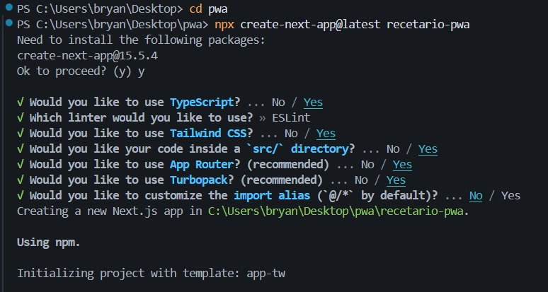

# PWA: Recetario Interactivo

## Contenido
- [Descripción](#descripción)
- [Tecnologías](#tecnologías)
- [Instalación](#instalación)
- [Uso](#uso)
- [Estructura del proyecto](#estructura-del-proyecto)
- [Funcionalidades](#funcionalidades)
- [Dependencias](#dependencias)
- [Demo](#demo)

## Descripción
Aplicación web progresiva (PWA) desarrollada con Next.js para explorar, guardar y seguir recetas de cocina, incluso sin conexión a internet. Integra cámara, vibración y lectura de voz para mejorar la experiencia del usuario.

## Tecnologías
- Next.js (App Router)
- TypeScript
- Tailwind CSS
- Service Worker (Offline / Cache)
- IndexedDB (Favoritos, fotos)
- APIs: MediaDevices, Vibration, Web Speech
- API externa: TheMealDB

## Instalación

1. Clonar el repositorio:
```bash
git clone https://github.com/BrySan20/recetario-pwa.git
```

2. Entrar al directorio del proyecto:
```bash
cd recetario-pwa
```

3. Instalar dependencias:
```bash
npm install
```

4. Ejecutar en modo desarrollo:
```bash
npm run dev
```

5. Abrir la app en el navegador:
```bash
http://localhost:3000
```


---

## 6. Uso / Funcionalidades principales
```markdown
- **Splash:** Animación inicial y precarga de recursos.
- **Home:** Visualiza recetas destacadas (SSR), accede a búsqueda y favoritos.
- **Búsqueda:** Filtra recetas usando CSR sin recargar la página.
- **Favoritos:** Guardar recetas e imágenes de platillos en IndexedDB.
- **Offline:** Últimas recetas vistas accesibles sin conexión.
- **Notificaciones:** Recordatorios de recetas guardadas.
- **Cámara:** Captura foto del platillo terminado.
- **Vibración:** Señal de paso completado en recetas.
- **Lectura de pasos:** Botón “Leer Pasos” para accesibilidad.
```

## 7. Estructura del proyecto

```markdown
recetario-pwa/
├── public/
│   ├── icons/              # Iconos PWA (resoluciones 192x192, 512x512)
│   ├── manifest.json       # Manifiesto PWA
│   └── sw.js              # Service Worker
├── src/
│   ├── app/
│   │   ├── layout.tsx     # Layout principal con metadata
│   │   ├── page.tsx       # Home (SSR) - recetas destacadas
│   │   ├── splash/
│   │   │   └── page.tsx   # Pantalla Splash
│   │   ├── recipe/
│   │   │   └── [id]/
│   │   │       └── page.tsx  # Detalle receta (SSR)
│   │   └── search/
│   │       └── page.tsx   # Búsqueda (CSR)
│   ├── components/
│   │   ├── RecipeCard.tsx      # Card de receta
│   │   ├── RecipeList.tsx      # Lista de recetas
│   │   ├── SearchBar.tsx       # Barra búsqueda
│   │   ├── CameraCapture.tsx   # Captura foto
│   │   └── VoiceReader.tsx     # Lector de voz
│   ├── lib/
│   │   ├── api.ts         # Cliente API TheMealDB
│   │   ├── db.ts          # IndexedDB helper
│   │   └── notifications.ts # Push notifications
│   ├── hooks/
│   │   ├── useCamera.ts   # Hook cámara
│   │   ├── useVibration.ts # Hook vibración
│   │   └── useOffline.ts  # Hook estado offline
│   └── types/
│       └── recipe.ts      # Tipos TypeScript
└── package.json

```

## Dependencias

### Producción

| Paquete                | Versión   | Propósito                                                       |
|-------------------------|-----------|-----------------------------------------------------------------|
| **next**               | 15.5.4    | Framework React con soporte SSR, CSR y PWA                      |
| **react**              | 19.1.0    | Librería principal de UI                                        |
| **react-dom**          | 19.1.0    | Renderizado de React en el DOM                                  |
| **next-pwa**           | 5.6.0     | Configuración PWA para Next.js                                  |
| **workbox-webpack-plugin** | 7.3.0 | Generación y gestión de Service Workers                        |
| **dexie**              | 4.2.0     | Manejo avanzado de IndexedDB                                    |
| **dexie-react-hooks**  | 4.2.0     | Hooks de React para usar Dexie en componentes                   |
| **idb**                | 8.0.3     | API simplificada para IndexedDB                                 |
| **framer-motion**      | 12.23.22  | Animaciones y transiciones fluidas                              |
| **lucide-react**       | 0.544.0   | Iconos modernos para React                                      |
| **react-webcam**       | 7.2.0     | Acceso a la cámara desde React                                  |

### Desarrollo

| Paquete                | Versión   | Propósito                                                       |
|-------------------------|-----------|-----------------------------------------------------------------|
| **typescript**         | ^5        | Tipado estático para JavaScript                                 |
| **tailwindcss**        | ^4        | Framework CSS utilitario                                        |
| **eslint**             | ^9        | Linter para mantener calidad de código                          |
| **eslint-config-next** | 15.5.4    | Configuración ESLint para proyectos Next.js                     |
| **@eslint/eslintrc**   | ^3        | Configuración extendida de ESLint                               |
| **@tailwindcss/postcss** | ^4      | Soporte de Tailwind con PostCSS                                 |
| **@types/node**        | ^20       | Tipos TypeScript para Node.js                                   |
| **@types/react**       | ^19       | Tipos TypeScript para React                                     |
| **@types/react-dom**   | ^19       | Tipos TypeScript para ReactDOM                                  |

## Instalación de dependencias

Instalar dependencias de producción:
```bash
npm install next react react-dom next-pwa workbox-webpack-plugin dexie dexie-react-hooks idb framer-motion lucide-react react-webcam
```


Instalar dependencias de desarrollo:
```bash
npm install -D typescript tailwindcss eslint eslint-config-next @eslint/eslintrc @tailwindcss/postcss @types/node @types/react @types/react-dom
```
---

## Demo

A continuación se muestran las distintas pantallas y funcionalidades implementadas en la app:

---

### 1. Pantalla de Splash
- Logo de la app, mensaje de bienvenida y animación de carga.


---

### 2. Pantalla Home
- Vista principal con recetas destacadas (SSR).
- Acceso a búsqueda, filtros y favoritos.


---

### 3. Búsqueda y Filtrado de Recetas (CSR)
- Búsqueda dinámica desde la API.
- Filtros aplicados en cliente.


---

### 4. Recetas Favoritas (Datos Locales en IndexedDB)
- Guardar y gestionar recetas favoritas.
- Persistencia entre sesiones.


---

### 5. Recetas Vistas Recientemente (Offline)
- Últimas recetas consultadas accesibles sin internet.


---

### 6. Notificaciones
- Ejemplo de notificación recordando recetas guardadas.


---

### 7. Uso de Cámara 📷
- Captura de foto del platillo terminado.
- Vista previa de la cámara y guardado en IndexedDB.


---

### 8. Sistema de Pasos con Vibración 📳
- Pasos de la receta.
- Vibración al avanzar en cada paso.


---

### 9. Lectura de Pasos con Voz 🔊
- Funcionalidad de accesibilidad usando Text-to-Speech.


